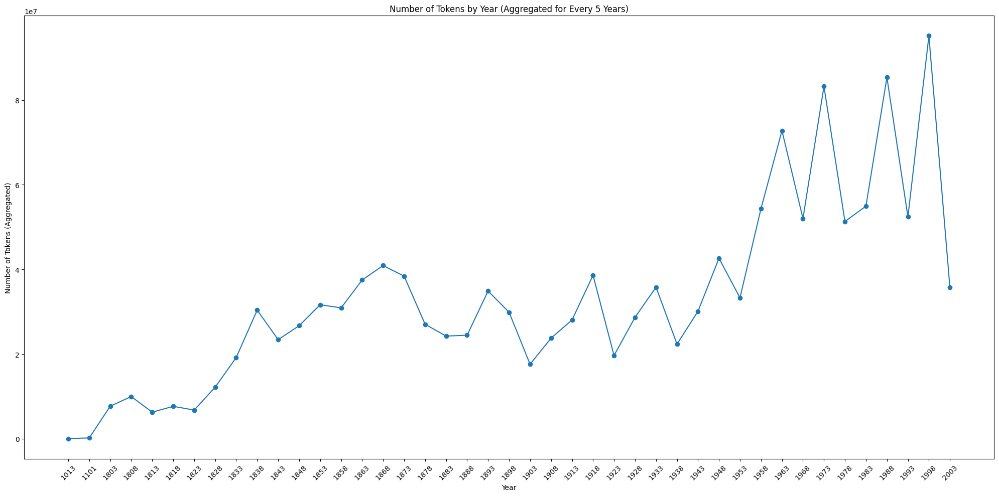
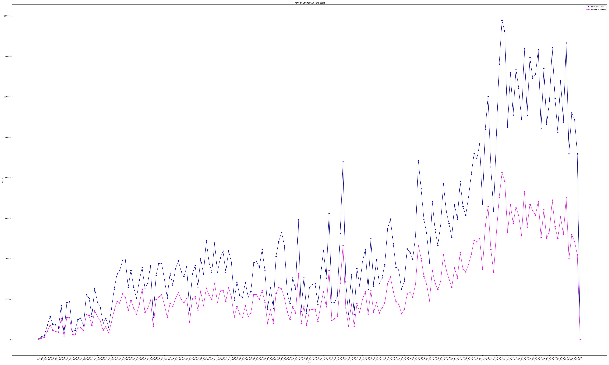
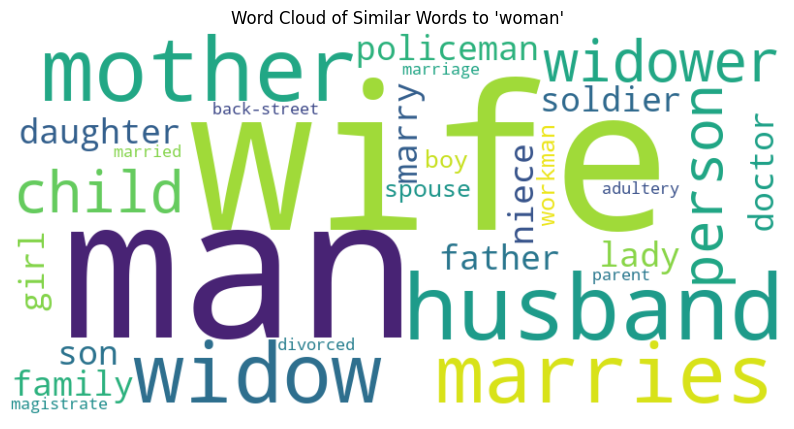
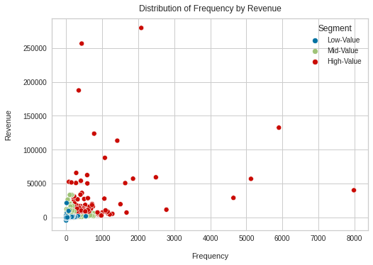
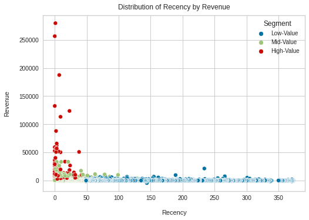
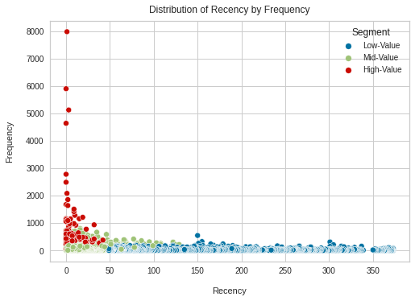
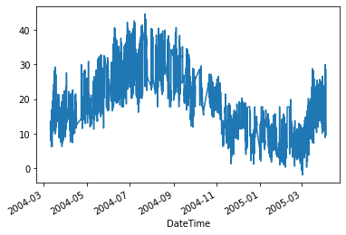
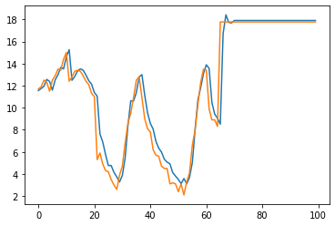
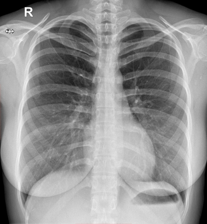

# Praharshita Kaithepalli

#### Technical Skills: Python, SQL, Archtics, R, MATLAB

# Education						       		
- MS,Data Science - Rochester Institute of Technology (_August 2021-December 2023_)	 			        		

# Work Experience
## Applied Data Scientist @ Civis Analytics (_Feb 2024 - Oct 2024_)

Analytics for non-profits.

- Enhanced client-facing R Shiny dashboards by debugging issues in undocumented code, resolving data flow errors with NULL values, and optimizing data loading times to reduce latency. Gathered client feedback to refine solutions, ensuring accurate, responsive, and user-friendly visuals.
- Enhanced data accessibility and reporting accuracy for a regional office of an international non-profit by collaborating with stakeholders to understand requirements and translating them into optimized ETL processes in Redshift-SQL, transforming raw Salesforce data into structured, actionable insights.
- Saved 100% of manual reporting time by building an interactive Tableau dashboard for over 100 data points and implementing YAML workflows for automated daily data refresh, collaborating with stakeholders to align data structure with reporting needs and support customer-focused insights

## Ticket Data Science/Analytics Intern @ BSE Global/Brooklyn Nets (_May 2023 - August 2023_)

Ticketing Analytics for NBA team Brooklyn Nets, WNBA team New York Liberty and the Barclays Center.

**Fan Retention Model**
- Analyzed  Brooklyn Nets’s full season membership holders metrics to enable **segmentation** and targeted marketing efforts.
- Employed **PostgreSQL** to merge from various tables and preprocessed it to enable modeling.
- Developed a fan retention model in **Python**, leveraging Supervised classifiers **(Lasso)**.
- Optimized model performance through strategic **hyperparameter tuning**.

 **Revenue and Tickets Sold Dashboards (PostgreSQL, Tableau):**
- Developed PostgreSQL scripts for data extraction and integration in Tableau.
- Facilitated an accurate automated daily revenue and ticket sales visualization by sales representatives. 
- Partnered with the ticket operations team to create an interactive Tableau dashboard for real-time tracking and reporting of daily and weekly ticket sales, categorized by membership type.

**Other projects:**
- Extracted and integrated multi-year customer membership data using PostgreSQL and MS Excel.
- Assigned tenure scoring based on renewal frequency and calculated tenure-driven membership discounts which improved the renewal rate by 30%.
- Utilized Python (BeautifulSoup) to collect 10,000+ school/university contacts from various online sources, effectively generating group sales leads for a WNBA game.
  
    

# Projects
## Computational analysis of Gender Perception in the UK Parliament (Python) - Web scraping, NLP 

- Developed a web scraping script to perform data mining of 4GB of text data from British parliament sittings  using BeautifulSoup.
- Conducted an analysis of gender representation by computing the ratio of male to female pronouns across 50 year intervals.
- Visualized the findings using a matplotlib graph, showcasing the trends in male and female pronoun usage over time.
- Utilized unsupervised FastText modeling on data from each 50 year interval to identify K-nearest neighbors for gender terms.
- Generated a word cloud using the nearest neighbors and their respective weights, providing insight into changes in language.
- Trained a GPT-3 model over chunks of data to study the change in the gender perception over the years.

   
  

  
  

## Customer Lifetime Value Analysis and Prediction (K-Means and XGBoost) (Python) – Clustering, Customer Segmentation, CRM Analytics
- Analyzed customer lifetime and expenditure metrics to enable segmentation and targeted marketing efforts.
- Applied KMeans to assign Recency, Frequency and Monetary scores and visualized the results  using Matplotlib.
- Developed a model to predict customer lifetime value (LTV) score with 88% accuracy using XGBoost.
  
  

   
  

# [Temperature Prediction using Air Quality using LSTM and Conv1D, Multivariate Time Series Forecasting-Python](https://github.com/pk2971/Air-Quality-vs-Temperature-time-series)

- Built a time series forcasting model to predict the atmospheric temperature at a given time of the day based off on the pollutant concentrations in the atmosphere.
- Cleaned a data set of 9000+ rows and prepared it to enable time series forecasting.
- Trained the data set on Conv1D and LSTM models and achieved high accuracy.
- Graphed the predicted vs. actual values of both data sets.
  

  

## [COVID-19 Image Classifier using VGG16-Python](https://github.com/pk2971/COVID-19-Image-Classification)

- Built a classifier to identify if a lung is effected by COVID-19 based on scan images.
- Used an ImageGenerator to scale images so that they can be efficiently used by the model.
- Used transfer learning on a CNN trained VGG16, which created time efficient and solid results.
- Predicted if the lung is effected by COVID-19 with 99% accuracy (from a new image).
  
   

## Visualization/Predicting Prices of AirBNB listings in New York city (Python) –Regression
- Analyzed a large dataset of AirBNB’s listings in NYC, processed over 70 features and performed exploratory data analysis(EDA) to identify patterns and insights.
- Built multiple regression models using Python to predict prices based on the patterns and measured their accuracy using RMSE and R^2.
- Optimized the best performing model (XGBoost) using BayesianOptimizer and achieved a 2% boost in accuracy.

## Twitter Data Analysis (R Language, Tableau) –Sentiment Mining
- Sourced and cleaned a data set for 2000 tweets of a global cosmetics company to perform sentiment analysis.
- Used Afinn, syuzhet packages to assign sentiment scores to the text data and visualized sentiment trends over time using Tableau.
- Developed wordcloud to identify the most frequently used words for the company’s cosmetic products available online.

